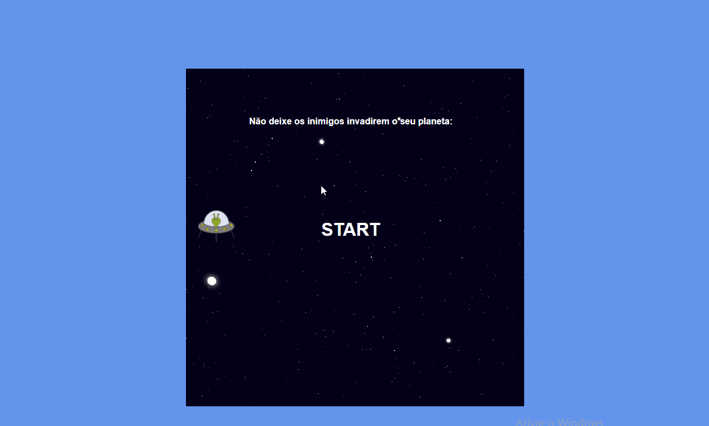

# Game proteja o planeta

## o Game foi construido com Javascript puro, foi muito bacana poder usar todo meu aprendizado e unir criando um game tão bacana me imaginava que criar um jogo seria dificil, más não é, é mais fácil do que parece, o segredo é a prática constante.

### Tecnologias utilizadas:
- HTML
- CSS
- JAVASCRIPT

Jogue na web -> https://space-shooter-one.netlify.app/

Feito com muito ❤️ por Brandon Carlos

